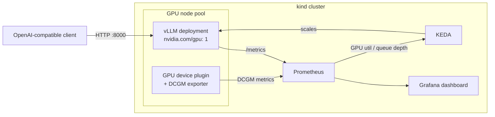
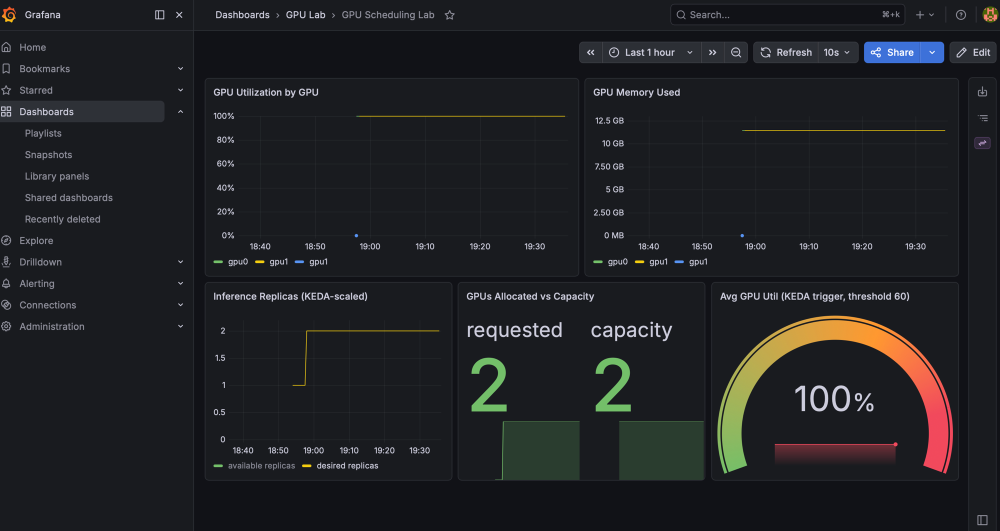

# k8s-gpu-scheduling-lab

A hands-on lab demonstrating **GPU-aware scheduling, autoscaling, and observability on Kubernetes** — the full path from a GPU node joining the cluster to an LLM inference workload (vLLM) being scheduled, monitored, and autoscaled on it.

Built and documented by [Goutham Katikireddy](https://www.linkedin.com/in/goutham-katikireddy) as part of a public AI-infrastructure portfolio.

## What this demonstrates

- **GPU scheduling** — `nvidia.com/gpu` resource requests, node labeling/taints for GPU pools, and how the scheduler places inference pods
- **GPU observability** — DCGM-style per-GPU metrics (utilization, memory, temperature) scraped by Prometheus and visualized in Grafana
- **Autoscaling on GPU/inference signals** — KEDA `ScaledObject` scaling the vLLM deployment off Prometheus queries instead of CPU
- **LLM inference serving** — vLLM serving an OpenAI-compatible API on Kubernetes

## Architecture



## What it looks like

The lab in action — GPU utilization jumps when the inference pods land on the GPU pool (~19:00), and KEDA scales the deployment from 1 to 2 replicas right after (bottom-left panel), once average utilization crossed the 60% trigger threshold. Both simulated A100s end up claimed:



## Two modes

| Mode | GPU | Use case |
|------|-----|----------|
| **sim** (default) | Simulated GPUs via [run.ai fake-gpu-operator](https://github.com/run-ai/fake-gpu-operator) — fake device plugin + fake DCGM metrics on a kind cluster | Free, laptop-only. Exercises the *scheduling, metrics, and autoscaling* path end to end. |
| **real** | A real NVIDIA GPU node (e.g., a rented A10 on runpod/Lambda, or bare metal) with the official [NVIDIA device plugin](https://github.com/NVIDIA/k8s-device-plugin) + [DCGM exporter](https://github.com/NVIDIA/dcgm-exporter) | Actual vLLM inference (Llama-3-8B) with real GPU telemetry. |

In **sim** mode the vLLM pod is replaced by a lightweight mock inference server that requests `nvidia.com/gpu: 1` and exports vLLM-shaped metrics, so scheduling and KEDA autoscaling behave identically — only the tokens are fake.

## Quickstart (sim mode)

Prereqs: Docker, `kind`, `kubectl`, `helm`.

```bash
make up           # kind cluster + GPU labels
make gpu          # fake-gpu-operator (simulated GPUs + DCGM metrics)
make monitoring   # kube-prometheus-stack (Prometheus + Grafana)
make keda         # KEDA
make vllm         # inference deployment + service + ScaledObject
make status       # watch it all come up
```

Then:

```bash
make grafana      # port-forward Grafana -> http://localhost:3000 (admin / gpu-lab)
make load         # generate inference traffic and watch KEDA scale the deployment
```

Tear down with `make down`.

## Repo layout

```
cluster/      kind cluster config (GPU-labeled worker pool)
manifests/
  gpu/        fake-gpu-operator values (sim) / NVIDIA device plugin notes (real)
  vllm/       inference Deployment + Service (sim + real variants)
  keda/       ScaledObject scaling on Prometheus GPU/queue metrics
  monitoring/ kube-prometheus-stack values
dashboards/   Grafana dashboard JSON (GPU util, memory, replica count, QPS)
scripts/      up/down/load-generation helpers
```

## Key things to look at

1. [`manifests/vllm/deployment.yaml`](manifests/vllm/deployment.yaml) — how an inference workload declares GPU resources, and the node-selection/toleration pattern for a dedicated GPU pool
2. [`manifests/keda/scaledobject.yaml`](manifests/keda/scaledobject.yaml) — autoscaling on a Prometheus query instead of CPU
3. [`dashboards/gpu-lab-dashboard.json`](dashboards/gpu-lab-dashboard.json) — the per-GPU + per-deployment view an SRE actually wants during an inference incident

## Roadmap

- [ ] MIG partitioning walkthrough (real mode, A100/A30)
- [ ] GPU time-slicing config for oversubscription
- [ ] Karpenter GPU node-pool autoscaling (EKS variant)

## License

MIT
